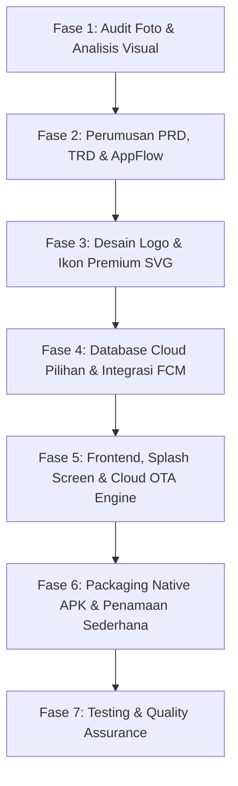

# 📘 SOP & Rencana Proses Produksi APK (Plan.md)

> **Dokumen:** Standard Operating Procedure (SOP) & Pipeline Produksi APK  
> **Tujuan:** Panduan komprehensif alur kerja dari ide desain foto hingga menjadi file APK Android fungsional, berkinerja tinggi, dan **100% Gratis** (Zero Cloud Cost).  
> **Catatan:** Daftar inventaris dan progres masing-masing aplikasi dikelola secara terpisah di **[APK.md](file:///c:/Users/Asep/OneDrive/Dokumen/App%20Craft/Kumpulan%20App%20Baru/APK.md)**.

---

## 🧭 1. Prinsip & Filosofi Rekayasa Sistem

Seluruh aplikasi yang diproduksi mengikuti standar arsitektur terpadu:

1. **100% Zero-Cost Serverless & Offline-First (Konfirmasi Pilihan Database):**
   - Sebelum pengembangan dimulai, **wajib tanyakan/konfirmasi kepada user** opsi database cloud yang ingin digunakan:
     - **Opsi 1: Google Sheets + Google Apps Script (GAS)** (Gratis, mudah dipantau langsung lewat spreadsheet visual).
     - **Opsi 2: Firebase** (Firestore / Realtime Database, Spark Plan gratis 0 Rupiah).
     - **Opsi 3: Supabase** (PostgreSQL gratis, fitur auth & query canggih).
   - Data selalu disimpan secara lokal (*Local-First*) di smartphone pengguna (`IndexedDB` atau `LocalStorage`), sehingga aplikasi tetap berjalan 100% lancar meski tanpa koneksi internet. Cloud database bertindak sebagai cadangan & sinkronisasi multi-device.
2. **Visual Fidelity (Persis Seperti Mockup):**
   - Mengadopsi tata letak, proporsi, *border radius*, tipografi, dan palet warna HEX persis seperti referensi foto.
   - Tampilan wajib menyertakan micro-interactions, bayangan halus (*soft blur shadow*), dan *touch feedback*.
3. **Logo Bespoke & Ikon Premium Inline SVG:**
   - Setiap aplikasi memiliki **Logo Unik** yang dirancang khusus sesuai identitas produknya.
   - Logo vektor master dibuat dalam format SVG beresolusi tinggi, kemudian diekspor menjadi *Android Adaptive Icons* (`mipmap-hdpi`, `mipmap-mdpi`, `mipmap-xhdpi`, `mipmap-xxhdpi`, `mipmap-xxxhdpi`).
   - Ikon antarmuka menggunakan vektor SVG inline murni yang tajam di layar resolusi tinggi, fleksibel diwarnai dengan CSS `currentColor`, dan ringan (0 KB overhead font).
4. **Wajib Memiliki Branded Loading / Splash Screen:**
   - Setiap APK wajib dilengkapi **Splash / Loading Screen** elegan saat pertama kali dibuka.
   - Menampilkan logo aplikasi dengan animasi denyut halus (*pulse / glow*), progress bar/spinner minimalis, dan transisi *fade-out* mulus saat inisialisasi data selesai.
5. **Mekanisme Update Revisi via Cloud (OTA / In-App Live Update):**
   - Pembaruan UI/UX atau perbaikan logika bug dapat disalurkan langsung via Cloud tanpa memaksa pengguna mengunduh dan menginstal ulang file APK secara manual.
   - Aplikasi memeriksa file versi di cloud (`version.json` di GitHub Pages / Google Sheets `App_Versions`). Jika terdapat revisi baru, bundel web akan diperbarui secara otomatis di latar belakang (*Over-The-Air Update*).
   - Jika terdapat pembaruan native besar, aplikasi menampilkan modal pop-up dengan tombol unduh langsung APK terbaru dari cloud link (Google Drive / GitHub Releases).
6. **Integrasi Push Notifikasi Firebase (FCM):**
   - Notifikasi real-time dan terjadwal (misal: alarm obat, streak habit, reminder event) disambungkan ke **Firebase Cloud Messaging (FCM)** paket gratis (Spark Plan 0 Rupiah).
   - Mendukung penerimaan pesan latar belakang (*background notification*) dan pesan interaktif (*in-app notification banner*).
7. **Penamaan File APK Sederhana & Ramah Share:**
   - Nama file APK dibuat ringkas, jelas, dan profesional sesuai nama/jenis aplikasinya tanpa embel-embel kode versi yang rumit, agar ramah dan enak saat dibagikan ke pengguna:  
     `[Nama Aplikasi].apk`  
     *Contoh:* `Master Finance.apk`, `Minimal Todo.apk`, `Should I Buy It.apk`.

---

## 🔄 2. Pipeline Produksi 7 Tahap (End-to-End Workflow)



---

### 🔍 FASE 1: Audit Foto & Analisis Visual
1. **Verifikasi Integritas File:**
   - Jalankan audit checksum SHA-256 pada seluruh foto untuk mengidentifikasi duplikat identik byte-for-byte sebelum pengerjaan dimulai.
2. **Dekonstruksi Elemen UI/UX dari Foto:**
   - Identifikasi rasio layout (Mobile viewport 9:16).
   - Ekstraksi warna dominan: Background, Card surface, Accent color, dan Text contrast.
   - Identifikasi hierarki komponen: Status bar, Header, Hero card, Bento grid, Bottom action dock / Floating Action Button (FAB).

---

### 📝 FASE 2: Perumusan Dokumen Produk (PRD, TRD & AppFlow)
1. **PRD (Product Requirements Document):**
   - Problem statement nyata, target user persona, dan 3-5 fitur kunci.
2. **TRD (Technical Requirements Document):**
   - Konfirmasi pilihan backend database cloud dari user (Google Sheets + GAS / Firebase / Supabase).
   - Struktur objek JSON lokal, skema tabel/koleksi database, dan logika bisnis.
3. **AppFlow (Diagram Alur Mermaid):**
   - Pemetaan navigasi pengguna dari Splash Screen -> Main Dashboard -> Action/Modal -> Sinkronisasi Cloud.

---

### 🎨 FASE 3: Desain Logo Khusus & Ikon Premium SVG
1. **Perancangan Logo Aplikasi (Branded Logo):**
   - Setiap APK dirancang memiliki logo ikonik yang mewakili fungsinya (contoh: *Minimal Todo* menggunakan lambang kalender bento dengan daun zen; *AI Calorie Tracker* menggunakan logo mangkuk ceri bergradasi neon).
   - Format master: File SVG vektor mandiri (`logo.svg`) dengan rasio 1:1 (512x512 px).
   - Ekspor otomatis ke seluruh folder Android icon:
     - `mipmap-mdpi` (48x48)
     - `mipmap-hdpi` (72x72)
     - `mipmap-xhdpi` (96x96)
     - `mipmap-xxhdpi` (144x144)
     - `mipmap-xxxhdpi` (192x192)
2. **Standardisasi Ikon Premium Inline SVG:**
   ```html
   <svg class="svg-icon" width="22" height="22" viewBox="0 0 24 24" fill="none" stroke="currentColor" stroke-width="1.8" stroke-linecap="round" stroke-linejoin="round">
     <!-- Path vektor murni -->
   </svg>
   ```
   - Ukuran Standar: Navigasi `20-22px`, Aksi Utama `24-28px`, Hero `32-40px`.

---

### 🗄️ FASE 4: Pemilihan Database Cloud & Push Notifikasi Firebase
1. **Setup Database Cloud Sesuai Pilihan User:**
   - **Jika Google Sheets + GAS:** Buat Google Spreadsheet sebagai database visual + endpoint Apps Script (`doGet`/`doPost`).
   - **Jika Firebase:** Setup project di Firebase Console, aktifkan Firestore / Realtime Database aturan gratis.
   - **Jika Supabase:** Buat project Supabase gratis, inisialisasi tabel SQL dan API key.
2. **Integrasi Firebase Cloud Messaging (FCM):**
   - Setup project gratis di Firebase Console.
   - Masukkan konfigurasi `google-services.json` ke folder `android/app/`.
   - Konfigurasi Service Worker `firebase-messaging-sw.js` untuk penanganan background notification.
   - Pengiriman notifikasi dapat dipicu langsung secara gratis dari Google Apps Script menggunakan FCM HTTP v1 API.

---

### 💻 FASE 5: Frontend, Loading Screen & Cloud OTA Update Engine
1. **Struktur Standar Proyek APK:**
   ```text
   nama-aplikasi/
   ├── index.html            # SPA + Splash Screen Container
   ├── style.css             # Desain responsif, tema, & animasi splash
   ├── app.js                # State management, Cloud DB sync (Sheets/Firebase/Supabase), & FCM listener
   ├── updater.js            # Modul Cloud OTA Update (cek revisi otomatis)
   ├── logo.svg              # Logo vektor master
   ├── firebase-messaging-sw.js # Background push worker
   ├── version.json          # File kontrol versi lokal ({ "version": "1.0.0" })
   ├── capacitor.config.json # Konfigurasi Android Capacitor
   └── android/              # Folder project native Android
   ```

2. **Standar Loading / Splash Screen:**
   - Markup diletakkan paling atas di dalam `<body>`:
     ```html
     <div id="app-splash-screen" class="splash-container">
       <div class="splash-logo-wrap">
         <!-- Logo SVG Aplikasi -->
         <svg class="splash-logo-svg">...</svg>
       </div>
       <h1 class="splash-app-title">Nama App</h1>
       <div class="splash-loader-bar">
         <div class="splash-loader-progress"></div>
       </div>
       <span class="splash-status-text">Memuat data...</span>
     </div>
     ```
   - CSS transisi halus:
     ```css
     .splash-container {
       position: fixed; inset: 0; z-index: 9999;
       display: flex; flex-direction: column; align-items: center; justify-content: center;
       background: var(--bg-main); transition: opacity 0.35s ease, visibility 0.35s ease;
     }
     .splash-container.hidden { opacity: 0; visibility: hidden; pointer-events: none; }
     ```
   - Skrip dismiss otomatis: Setelah `DOMContentLoaded` dan data awal lokal termuat, panggil `App.hideSplash()` (delay 400-800ms agar logo terlihat estetis dan tidak kedip).

3. **Mekanisme Cloud OTA Update (Update Revisi Otomatis):**
   - Saat aplikasi dibuka, modul `updater.js` mengecek endpoint cloud versi (Google Sheets atau GitHub raw `version.json`):
     ```javascript
     async function checkCloudUpdates() {
       try {
         const res = await fetch(CLOUD_VERSION_URL);
         const remote = await res.json();
         if (remote.versionCode > LOCAL_VERSION_CODE) {
           if (remote.updateType === 'ota') {
             // Muat revisi file web baru secara instan
             applyOtaHotfix(remote.patchUrl);
           } else {
             // Tampilkan modal unduh APK baru
             showUpdatePromptModal(remote.apkDownloadUrl, remote.changeLog);
           }
         }
       } catch (e) { /* Tetap jalan offline */ }
     }
     ```

---

### 📦 FASE 6: Packaging Native APK & Penamaan Sederhana
1. **Langkah Inisialisasi & Build:**
   ```bash
   # 1. Konfigurasi ID & Nama
   npx cap init "Nama Aplikasi" "com.appcraft.namaapp" --web-dir "."
   npx cap add android
   npx cap copy

   # 2. Build APK Release / Debug
   cd android
   ./gradlew assembleRelease
   ```
2. **Penamaan Sederhana File APK (Siap Share):**
   - Hasil build di-rename dengan nama sederhana yang rapi dan elegan, siap langsung dibagikan:
     `Master Finance.apk`
     `Minimal Todo.apk`
     `Should I Buy It.apk`

---

### ✅ FASE 7: Quality Assurance & Testing Checklist
- [ ] **Branding:** Logo unik SVG terpasang di splash screen dan app icon Android (`mipmap`).
- [ ] **Loading Screen:** Splash screen tampil mulus tanpa kedip putih sebelum dashboard muncul.
- [ ] **Cloud OTA:** Modul update dapat mendeteksi revisi cloud baru.
- [ ] **Push Notification:** Token FCM berhasil terdaftar dan dapat menerima notifikasi pesan.
- [ ] **Cloud Database Sync:** Sinkronisasi cloud (Google Sheets / Firebase / Supabase sesuai opsi pilihan) berjalan lancar saat online.
- [ ] **Offline Resilience:** Aplikasi tetap bisa digunakan penuh saat internet mati.
- [ ] **File APK:** File APK tersimpan dengan nama sederhana dan bersih (contoh: `Master Finance.apk`) serta dapat diinstal langsung di HP Android.
